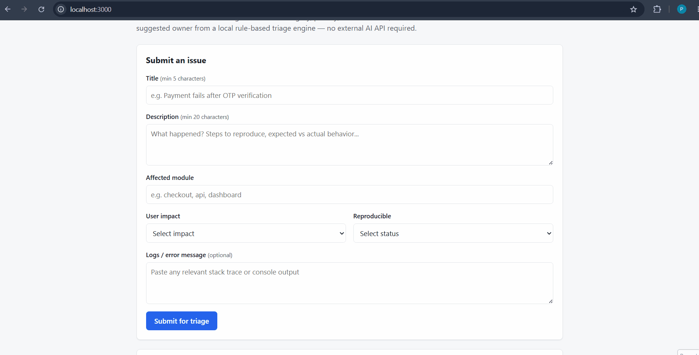

# Smart Issue Triage


A small full-stack app that accepts a software issue report and automatically
classifies it into a **category**, **priority**, **estimated effort**, and
**suggested owner**, using a local, rule-based scoring engine (no paid AI API
required).

## Features

- Deterministic rule-based issue classification
- Confidence scoring with human-readable reasoning
- Input validation with clear error messages
- Session-based issue history
- REST API (`POST /api/triage`)
- Comprehensive unit tests using Vitest

## Setup

```bash
npm install
```

## Run

```bash
npm run dev
```

The app runs at `http://localhost:3000`. The triage form is on the home page,
and results plus session history render on the same page after each
submission.

For a production build:

```bash
npm run build
npm start
```

## Test

```bash
npm test
```

Runs the Vitest suite covering validation, classification, and the API route
(success and invalid-input cases). Use `npm run test:watch` for watch mode.
No API keys are required for tests to run.

## Demo



## Tech Stack

- **Next.js 14** (App Router) with **TypeScript**
- **React 18** for the UI
- Next.js **Route Handlers** as the Node.js API layer (`POST /api/triage`)
- **Vitest** for unit testing
- Plain CSS (no UI framework) for styling
- `sessionStorage` for client-side issue history (no database)

## Project Structure

```
smart-issue-triage/
├── .env.example
├── .gitignore
├── package.json
├── README.md
├── tests/
│   ├── classifyIssue.test.ts
│   ├── validateIssue.test.ts
│   └── api.test.ts
└── src/
    ├── app/
    │   ├── layout.tsx
    │   ├── page.tsx
    │   ├── globals.css
    │   └── api/triage/route.ts
    ├── components/
    │   ├── IssueForm.tsx
    │   ├── ResultCard.tsx
    │   └── HistoryTable.tsx
    ├── lib/
    │   ├── storage.ts
    │   ├── constants.ts
    │   ├── utils.ts
    │   └── triage/
    │       ├── classifyIssue.ts
    │       ├── validateIssue.ts
    │       ├── scoring.ts
    │       └── keywords.ts
    └── types/
        └── issue.ts
```

## API Documentation

### `POST /api/triage`

**Request body**

```json
{
  "title": "Payment fails after OTP verification",
  "description": "Users are unable to complete checkout after OTP verification. The page freezes and no order is created.",
  "module": "checkout",
  "impact": "blocking",
  "reproducible": "yes",
  "logs": "TypeError: Cannot read properties of undefined"
}
```

| Field          | Required | Notes                                              |
| -------------- | -------- | --------------------------------------------------- |
| `title`        | yes      | At least 5 characters                                |
| `description`  | yes      | At least 20 characters                               |
| `module`       | yes      | Free text (e.g. `checkout`, `api`, `dashboard`)       |
| `impact`       | yes      | One of `none`, `minor`, `major`, `blocking`           |
| `reproducible` | yes      | One of `yes`, `no`, `unknown`                         |
| `logs`         | no       | String, optional error/log excerpt                   |

**Success response — `200 OK`**

```json
{
  "category": "bug",
  "priority": "critical",
  "effort": "medium",
  "owner": "backend",
  "confidence": 0.84,
  "reasoning": [
    "Runtime TypeError indicates an application bug.",
    "Application freezing is characteristic of a bug.",
    "Checkout flow affects a business-critical path.",
    "Blocking impact increases priority."
  ]
}
```

**Validation error — `400 Bad Request`**

```json
{
  "error": "Validation failed.",
  "errors": ["Title is required.", "Description must be at least 20 characters."]
}
```

**Malformed JSON — `400 Bad Request`**

```json
{ "error": "Request body must be valid JSON." }
```

## Triage Logic Explanation

The triage engine (`src/lib/triage/`) is a deterministic, rule-based scoring
system — no external model calls, so it's free, fast, and fully testable:

1. **Keyword matching** (`keywords.ts`, `scoring.ts`): the title, description,
   and logs are concatenated, normalized, and checked against a table of
   keyword rules. Each match contributes weighted points toward a `category`
   and an `owner`, and some rules add a priority boost or an effort hint
   (e.g. `sql injection` and `xss` push hard toward `security`; `data loss`
   pushes toward high severity + large effort).
2. **Impact scoring**: `blocking` adds the most to the priority score, then
   `major`, then `minor`. This is on top of any keyword-based priority boosts.
3. **Module hints**: the affected module is checked against known
   frontend/backend/devops module sets to nudge `owner`, and against a
   business-critical module set (payment, checkout, billing, login,
   authentication, admin) to add priority score.
4. **Category / owner selection**: whichever category or owner accumulated
   the highest score wins; ties fall back to `other` / `product`.
5. **Priority thresholds**: the accumulated priority score is bucketed into
   `low` / `medium` / `high` / `critical`.
6. **Confidence**: starts at a base value, is nudged up when the issue is
   marked reproducible, nudged down when marked `unknown`, increased with
   the number of keyword matches (capped), and reduced for very short
   descriptions or when no keywords matched at all. The final value is
   clamped to `[0, 1]`.

The API route (`app/api/triage/route.ts`) only orchestrates: parse JSON →
validate → classify → respond. It intentionally does not contain any
classification logic itself, keeping AI/business logic separate from the
HTTP layer.

## Known Limitations

- Keyword matching is substring-based, so it can be tricked by unrelated
  text that happens to contain a matched phrase (e.g. "the token booth
  outside the office" would still match `token`).
- The classifier has no real understanding of context, negation, or sarcasm
  — "no security issue was found" would still score as security-related.
- History is stored in `sessionStorage` only, so it's per-tab and cleared
  once the tab is closed; it is not shared across devices or persisted to a
  database.
- The keyword and module lists are hand-curated and English-only.

## Future Improvements

- Replace/augment keyword matching with embeddings or a small local
  classifier for better handling of paraphrased or non-English reports.
- Persist history server-side (with a real database) once multi-user access
  is needed, storing only non-sensitive fields.
- Add authentication so triage history can be scoped per user/team.
- Add end-to-end tests (Playwright/Cypress) covering the full submit →
  result → history flow in the browser.
- Add accessibility passes (ARIA live regions for the result card, better
  keyboard navigation for the history table).

## High Thinking Questions

**1. How did you decide category, priority, effort, and owner from
unstructured text?**
By using Rule-based weighted scoring, where keywords contribute weighted
scores for `category` and `owner`, while `impact` level and `module`
increase priority. Certain keywords suggest effort. Text signals and 
structured signals are combined additively rather than one overriding
the other, so a "minor" impact issue that mentions `sql
injection` can still be escalated by keyword weight.

**2. What edge cases can break your classifier?**
Negated statements ("not a security issue"), issues with multiple 
categories with roughly equal keyword weight creates issues in scoring
since the higher score wins, very short but information-dense reports, and
text in a language other than English as no keyword will match.

**3. If this system used a real LLM API, how would you prevent hallucinated
outputs?**
Forcing the LLM to return a strict JSON format with only the allowed enum 
values, use low temperature for consistent outputs, cross-check the LLM's
result against the existing keyword rules as a sanity check, and show the
reasoning so wrong classifications are easy to spot.

**4. How would you make the API safe from prompt injection or malicious
user input?**
Treating all submitted text as untrusted data, not as instructions. If an LLM
is used, keep user input separate from the system prompt and not be
concatenated into the system prompt. In the current rule-based system, the
main risk is oversized requests or malformed JSON, so they should be
validated and rejected before reaching the classifier.

**5. How would you measure whether the triage engine is accurate?**
Creating a labeled dataset with the expected category, priority, owner, and
effort, then compare the classifier's output against it. Track 
precision/recall per category plus a priority-distance metric. Track this
over time as keyword rules change.

**6. If 10,000 issues are submitted per day, what changes would you make in
backend design?**
If we move the classification to background work then users don't have to wait
for it to finish. Replacing sessionStorage with a real database, add rate
limiting to prevent abuse and consider batching or horizontal scaling of the
classification workers if the engine grows more expensive.

**7. What should be stored in a database, and what should not be stored for
privacy reasons?**
Issue title, description, module, impact, reproducible status,
classification result, and timestamps should be stored in database. Avoiding
storing sensitive information like passwords, tokens, or full logs unless
they're cleaned first. And If logs must be kept, they should be scrubbed or
stored with strict access controls and a retention limit.

**8. How would you design confidence scoring?**
Confidence should increase when more keyword rules match and the issue has
enough useful information, like a detailed description or reproducible steps.
It should decrease for vague descriptions and conflicting/unmatching signals.
The score should always stay between 0 and 1 and as such be treated as an
indicator, not a guarantee.

**9. What is the difference between a deterministic rule-based classifier
and an LLM-based classifier?**
A rule-based classifier is predictable since the same input always gives the
same output, making it easier to understand, test, and debug, but has limited
scope in real world applications. An LLM-based classifier can understand context
and different ways of phrasing the same issue, but it costs more to run and can
sometimes produce inconsistent results due to hallucinations.

**10. How would you improve the UI for a real engineering team?**
Add filtering and sorting to make issues easier to find, allow users to correct
incorrect classifications, integrate with tools like Jira or GitHub, and add a
dashboard showing trends such as issue volume, priority, and category over time.
